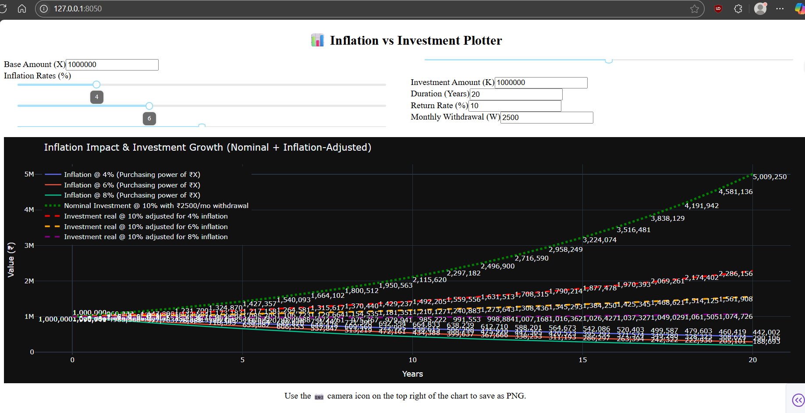

# 💸 Inflation & SWP Plotter 📈

Ever wondered how your investments will look after years of withdrawing monthly income *and* dealing with inflation? This interactive app lets you visualize exactly that—*and even lets you save the results!*

---

## 🔍 What This App Does

This tool helps you simulate:

- How long your investment lasts when you're withdrawing a **Systematic Withdrawal Plan (SWP)** every month.
- How **inflation eats into your corpus** over time.
- What’s left after `T` years — both **actual value** and **inflation-adjusted value** 💡

All of this with a beautiful Plotly plot + an option to save the image locally.

---

## 🚀 Features

- 📊 Interactive Plotly graph
- 🧠 Inflation-adjusted results alongside nominal values
- 💾 Save plot image as PNG
- 💻 Command line interface via `argparse`
- 🖱️ Minimal UI with Dash — runs in your browser!
- ✅ Clean structure, ready for collaboration and contribution

---

## 🛠️ Requirements

- Python ≥ 3.8
- All dependencies listed in `requirements.txt`

---
# Example usage

---

Install everything in one go:
```bash
pip install -r requirements.txt

